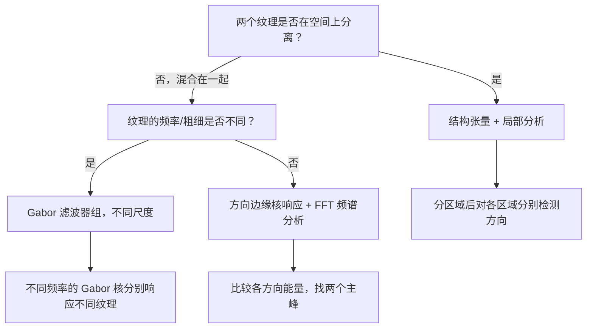

# 单张图片中两个不同方向纹理的检测方法

本文档系统性地介绍了在单张图片中检测两个不同方向纹理的五大方法，涵盖空间域、频域、统计方法和现代计算机视觉技术。

---

## 方法一：方向边缘响应能量比较（基于项目现有 Prewitt 核）

项目中 `src/edge_process.py` 已经实现了 8 方向 Prewitt 边缘检测核（`_SPATIAL_KERNELS`），可以直接用来判别纹理方向。

### 原理

对整幅图应用不同方向的边缘检测核，哪个方向的响应能量最大，就说明纹理沿哪个方向延伸。如果有两个方向的能量都显著高于其他方向，就说明图像中存在两个不同方向的纹理。

### 代码示例

```python
import numpy as np
from scipy.ndimage import convolve

# 项目中已有的 8 方向空间核（从 edge_process.py 导入）
from src.edge_process import (
    SPATIAL_HORIZONTAL,   # 0°   — 检测垂直边缘
    SPATIAL_VERTICAL,     # 90°  — 检测水平边缘
    SPATIAL_45,           # 45°
    SPATIAL_135,          # 135°
    SPATIAL_NEG45,        # -45°
    SPATIAL_NEG135,       # -135°
    SPATIAL_180,          # 180° — 水平边缘
    SPATIAL_90,           # 90°  — 垂直边缘（180°转置）
)

def detect_texture_direction_by_edges(image, kernels):
    """
    通过比较各方向核的响应能量来判断纹理方向。

    参数:
        image: 灰度图像，形状 (H, W)，dtype float 或 uint8
        kernels: 字典，{方向名: (3,3) 核数组}

    返回:
        responses: 字典，{方向名: 响应能量}
        dominant: 按能量降序排列的方向名列表
    """
    responses = {}
    for name, kernel in kernels.items():
        # 对图像做 2D 卷积
        response = convolve(image.astype(np.float64), kernel)
        # 计算响应能量（L2 范数或绝对值均值）
        energy = np.sum(np.abs(response))
        responses[name] = energy

    # 按能量降序排列
    dominant = sorted(responses, key=responses.get, reverse=True)
    return responses, dominant


# 使用示例
kernels = {
    "0°(水平)":   SPATIAL_HORIZONTAL,
    "90°(垂直)":  SPATIAL_VERTICAL,
    "45°":        SPATIAL_45,
    "135°":       SPATIAL_135,
    "-45°":       SPATIAL_NEG45,
    "-135°":      SPATIAL_NEG135,
    "180°":       SPATIAL_180,
    "90°(转置)":  SPATIAL_90,
}

responses, dominant = detect_texture_direction_by_edges(image, kernels)
print(f"响应能量: {responses}")
print(f"主导方向 (Top 2): {dominant[:2]}")

# 判断是否有两个显著方向
top2_energies = [responses[d] for d in dominant[:2]]
rest_avg = np.mean([responses[d] for d in dominant[2:]])
if top2_energies[1] > rest_avg * 1.3:
    print(f"图像中存在两个不同方向的纹理: {dominant[0]} 和 {dominant[1]}")
```

### 优缺点

| 优点 | 缺点 |
|------|------|
| 与项目现有代码高度兼容 | 只能区分有限的方向（8个） |
| 计算速度快 | 无法区分纹理的粗细/频率 |
| 实现简单 | 对噪声敏感 |

---

## 方法二：Gabor 滤波器组（纹理分析的黄金标准）

Gabor 滤波器是专门为纹理方向分析设计的带通滤波器，可以同时捕捉纹理的**频率**（粗细）和**方向**。

### 原理

Gabor 核是高斯窗调制的正弦波：

$$
G(x, y; \lambda, \theta, \sigma, \gamma) = \exp\left(-\frac{x'^2 + \gamma^2 y'^2}{2\sigma^2}\right) \cdot \cos\left(2\pi \frac{x'}{\lambda}\right)
$$

其中：
- $\lambda$：波长（决定纹理频率/粗细）
- $\theta$：滤波器方向
- $\sigma$：高斯窗标准差
- $\gamma$：椭圆率（空间纵横比）

### 代码示例

```python
import cv2
import numpy as np

def create_gabor_filter(ksize=31, sigma=4.0, theta=0, lambd=10.0, gamma=0.5):
    """
    创建 Gabor 滤波器核。

    参数:
        ksize: 核大小
        sigma: 高斯包络的标准差
        theta: 滤波器方向（弧度）
        lambd: 正弦波波长
        gamma: 空间纵横比
    """
    return cv2.getGaborKernel(
        (ksize, ksize), sigma, theta, lambd, gamma, psi=0, ktype=cv2.CV_32F
    )


def detect_texture_by_gabor(image, n_angles=8, n_frequencies=3):
    """
    使用多尺度、多方向 Gabor 滤波器组检测纹理方向。

    参数:
        image: 灰度图，dtype=float32，归一化到 [0, 1]
        n_angles: 方向数量（如 8 → 0°, 22.5°, 45°, ...）
        n_frequencies: 频率尺度数量

    返回:
        angle_responses: 每个角度的总响应能量
        dominant_angles: 能量最强的两个方向（度）
    """
    angles = np.linspace(0, np.pi, n_angles, endpoint=False)
    lambdas = [8.0, 12.0, 16.0][:n_frequencies]  # 多种波长对应粗细纹理

    angle_responses = np.zeros(n_angles)

    for i, theta in enumerate(angles):
        for lambd in lambdas:
            kernel = create_gabor_filter(
                ksize=31, sigma=4.0, theta=theta, lambd=lambd, gamma=0.5
            )
            filtered = cv2.filter2D(image, cv2.CV_32F, kernel)
            angle_responses[i] += np.sum(np.abs(filtered))

    # 找出能量最强的两个方向
    top2_idx = np.argsort(angle_responses)[-2:]
    dominant_angles = [np.degrees(angles[i]) for i in top2_idx]

    return angle_responses, dominant_angles
```

### 多频率尺度的意义

| 频率 | 波长 $\lambda$ | 能检测的纹理 |
|------|---------------|-------------|
| 高 | 6–8 px | 细密纹理（如细条纹、高频噪点） |
| 中 | 10–14 px | 中等纹理（如木板纹理、织物） |
| 低 | 16–20 px | 粗纹理（如宽条纹、大型图案） |

### 优缺点

| 优点 | 缺点 |
|------|------|
| 可区分不同粗细的纹理 | 核大小和波长需要手动调参 |
| 多频率多方向覆盖全面 | 计算量较大 |
| 接近人类视觉系统的响应 | 对尺度选择敏感 |

---

## 方法三：傅里叶频谱分析（频域方法）

纹理的方向信息在频域中表现为能量沿特定角度的集中。

### 原理

- 纹理方向 $\perp$ 频谱能量集中方向（相差 90°）
- 如果纹理沿水平方向延伸，其频谱能量会集中分布在**垂直方向**
- 两个不同方向的纹理 → 频谱中出现**两组不同角度的能量峰**

### 代码示例

```python
import numpy as np

def detect_texture_direction_fft(image):
    """
    通过 2D FFT 的频谱角度分布检测纹理方向。

    参数:
        image: 灰度图像，形状 (H, W)

    返回:
        texture_directions: 检测到的纹理方向列表（度，0~180）
        angle_energy: 每个角度的频谱能量分布
    """
    # 1. 计算 2D FFT 并中心化
    f = np.fft.fft2(image.astype(np.float64))
    fshift = np.fft.fftshift(f)
    magnitude = np.abs(fshift)

    # 2. 频谱从直角坐标 → 极坐标
    h, w = magnitude.shape
    center_y, center_x = h // 2, w // 2
    max_radius = min(center_y, center_x)

    # 3. 按角度分桶统计能量（角分辨率 1°）
    n_angles = 180
    angle_energy = np.zeros(n_angles)

    for y in range(h):
        for x in range(w):
            dy = y - center_y
            dx = x - center_x
            r = np.sqrt(dx**2 + dy**2)
            # 排除 DC 分量（中心点）和边界
            if 5 < r < max_radius * 0.9:
                angle = np.degrees(np.arctan2(dy, dx)) % 180
                bin_idx = int(angle * n_angles / 180)
                angle_energy[bin_idx] += magnitude[y, x]

    # 4. 找出能量集中的角度
    # 纹理方向 ⊥ 频谱能量方向 → 纹理方向 = 频谱峰方向 + 90°
    peak_indices = np.argsort(angle_energy)[-4:]  # 取前4个峰
    texture_directions = [((i + 90) % 180) for i in peak_indices]

    # 5. 合并相近方向（容忍 ±10°）
    merged = []
    for d in sorted(texture_directions):
        if not merged or min(abs(d - m) for m in merged) > 10:
            merged.append(d)

    return merged[:2], angle_energy  # 返回前两个独立方向
```

### 可视化频谱

```python
import matplotlib.pyplot as plt

def plot_fft_analysis(image, angle_energy, texture_directions):
    """可视化频谱分析结果"""
    fig, axes = plt.subplots(1, 3, figsize=(15, 4))

    # 原图
    axes[0].imshow(image, cmap='gray')
    axes[0].set_title('原图')
    axes[0].axis('off')

    # 频谱
    f = np.fft.fft2(image.astype(np.float64))
    fshift = np.fft.fftshift(f)
    magnitude = np.log(np.abs(fshift) + 1)
    axes[1].imshow(magnitude, cmap='hot')
    axes[1].set_title('对数频谱')
    axes[1].axis('off')

    # 角度-能量分布
    axes[2].plot(angle_energy)
    for d in texture_directions:
        axes[2].axvline(x=d, color='r', linestyle='--',
                         label=f'纹理方向 {d}°')
    axes[2].set_xlabel('角度 (°)')
    axes[2].set_ylabel('频谱能量')
    axes[2].set_title('频谱角度-能量分布')
    axes[2].legend()
    plt.tight_layout()
    plt.show()
```

### 优缺点

| 优点 | 缺点 |
|------|------|
| 全局分析，不受局部噪声影响 | 只给出全局方向，无法定位 |
| 不需要预设方向数量 | 计算量大（逐像素角度计算） |
| 角度分辨率可调 | 对非周期性纹理效果差 |

---

## 方法四：结构张量（Structure Tensor）— 逐像素方向分析

结构张量可以给**每个像素**分配一个主方向，适合空间上分离的两个纹理区域。

### 原理

对每个像素计算梯度，构建局部梯度协方差矩阵（结构张量）：

$$
J = \begin{bmatrix}
\sum I_x^2 & \sum I_x I_y \\
\sum I_x I_y & \sum I_y^2
\end{bmatrix}
$$

对 $J$ 做特征值分解：
- **主方向** $\theta = \frac{1}{2}\arctan2(2J_{xy}, J_{xx} - J_{yy})$
- **相干性** $C = \frac{\sqrt{(J_{xx}-J_{yy})^2 + 4J_{xy}^2}}{J_{xx} + J_{yy}}$ → 值越大方向越明确

### 代码示例

```python
import cv2
import numpy as np

def structure_tensor_direction(image, window_size=5):
    """
    计算每个像素的局部纹理方向（基于梯度结构张量）。

    参数:
        image: 灰度图像
        window_size: 局部窗口大小（越大越平滑）

    返回:
        orientation_map: 逐像素方向角（度，0~180）
        coherence_map: 逐像素相干性（0~1，越大方向越明确）
    """
    # 计算梯度
    Ix = cv2.Sobel(image, cv2.CV_64F, 1, 0, ksize=3)
    Iy = cv2.Sobel(image, cv2.CV_64F, 0, 1, ksize=3)

    # 构建结构张量的三个分量（对局部窗口求和）
    kernel = np.ones((window_size, window_size)) / window_size**2
    Jxx = cv2.filter2D(Ix * Ix, -1, kernel)
    Jxy = cv2.filter2D(Ix * Iy, -1, kernel)
    Jyy = cv2.filter2D(Iy * Iy, -1, kernel)

    # 计算每个像素的方向角
    orientation = 0.5 * np.arctan2(2 * Jxy, Jxx - Jyy)  # 范围 [-π/2, π/2]

    # 计算相干性
    trace = Jxx + Jyy + 1e-8
    coherence = np.sqrt((Jxx - Jyy)**2 + 4 * Jxy**2) / trace

    return np.degrees(orientation) % 180, np.clip(coherence, 0, 1)


def find_texture_directions_from_tensor(orient_map, coh_map, coh_threshold=0.3):
    """
    从结构张量结果中提取主导纹理方向。

    参数:
        orient_map: 方向图
        coh_map: 相干性图
        coh_threshold: 相干性阈值

    返回:
        dominant_directions: 主导方向列表
    """
    # 只统计高相干性像素的方向
    mask = coh_map > coh_threshold
    valid_orientations = orient_map[mask]

    if len(valid_orientations) == 0:
        return []

    # 方向直方图
    hist, bins = np.histogram(valid_orientations, bins=180, range=(0, 180))

    # 找峰值
    from scipy.signal import find_peaks
    peaks, _ = find_peaks(hist, height=hist.max() * 0.3, distance=15)

    # 返回前两个峰值对应的角度
    peak_heights = hist[peaks]
    top_peaks = peaks[np.argsort(peak_heights)[-2:]]

    return [int(bins[p]) for p in sorted(top_peaks)], hist
```

### 优缺点

| 优点 | 缺点 |
|------|------|
| 逐像素分析，可定位纹理区域 | 对噪声敏感，需要平滑 |
| 能给出方向确信度（相干性） | 窗口大小影响结果 |
| 适合空间分离的多纹理场景 | 无法区分纹理频率 |

---

## 方法五：区域分割 + 局部分析

如果两个纹理在**空间上是分离的**（例如上半部分水平纹理、下半部分垂直纹理），可以先分割再分别检测。

### 代码示例

```python
def sliding_window_texture_analysis(image, block_size=64, stride=32):
    """
    滑动窗口分析每个区块的纹理方向。

    参数:
        image: 灰度图像
        block_size: 分析窗口大小
        stride: 滑动步长

    返回:
        results: [(x, y, direction_angle), ...] 列表
    """
    h, w = image.shape
    results = []

    for y in range(0, h - block_size, stride):
        for x in range(0, w - block_size, stride):
            block = image[y:y + block_size, x: x + block_size]

            # 对该区块用方法一（方向边缘检测）检测方向
            responses = {}
            for name, kernel in kernels.items():
                conv = convolve(block.astype(np.float64), kernel)
                responses[name] = np.sum(np.abs(conv))

            dominant_dir = max(responses, key=responses.get)
            results.append((x, y, dominant_dir, responses[dominant_dir]))

    return results
```

---

## 方法选择决策树



---

## 方法对比总结

| 方法 | 精度 | 速度 | 定位能力 | 频率选择性 | 实现难度 |
|------|------|------|----------|-----------|---------|
| 方向边缘响应 | ★★★ | ★★★★★ | 无 | 无 | ★ |
| Gabor 滤波器组 | ★★★★★ | ★★★ | 有 | ★★★★★ | ★★★ |
| FFT 频谱分析 | ★★★★ | ★★ | 无 | ★★★ | ★★★ |
| 结构张量 | ★★★★ | ★★★★ | ★★★★★ | 无 | ★★ |
| 区域分割+局部分析 | ★★★ | ★★ | ★★★★★ | 取决于子方法 | ★★ |

---

## 针对本项目的建议

本项目的 `src/edge_process.py` 已经实现了 **8 方向 Prewitt 边缘检测核**（`_SPATIAL_KERNELS`），最快的方式是：

1. **对单帧图像**用已有的空间核做 2D 卷积（不需要 3D 时间核）
2. 比较 8 个方向的**响应能量**，找出能量最高的 2 个方向
3. 如果两个方向的能量都显著高于其他方向（如高出 30%），说明存在两个不同方向的纹理

如果需要区分**粗细不同**的纹理（如粗条纹 vs 细条纹），建议加入 **Gabor 滤波器**（方法二）。

如果需要**定位**纹理区域（知道哪个区域是哪种纹理），建议使用**结构张量**（方法四）。

---

## 参考文献

- Daugman, J. G. (1985). "Uncertainty relation for resolution in space, spatial frequency, and orientation optimized by two-dimensional visual cortical filters." JOSA A.
- Haralick, R. M., et al. (1973). "Textural features for image classification." IEEE SMC.
- Bigun, J., & Granlund, G. H. (1987). "Optimal orientation detection of linear symmetry." ICCV.
- Tamura, H., et al. (1978). "Textural features corresponding to visual perception." IEEE SMC.
